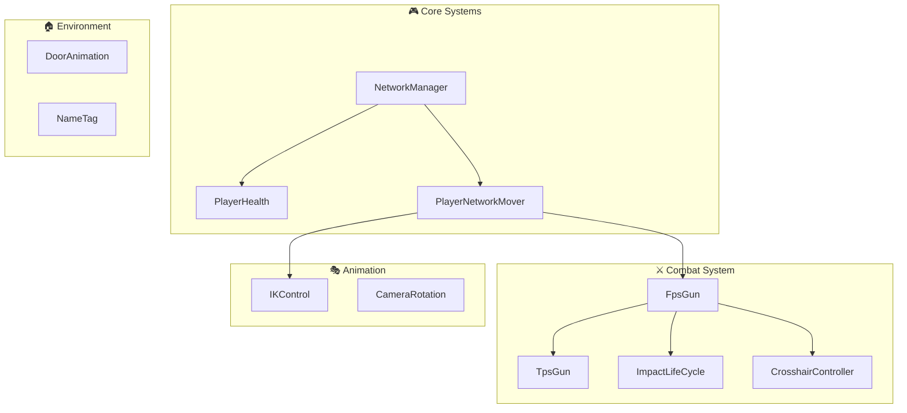

# 📁 ساختار پروژه و فایل‌ها

<div align="center">

**بررسی معماری و سازمان‌دهی کد در Multiplayer FPS**

</div>

---

## 🗂️ ساختار کلی پروژه

```
Multiplayer-FPS-master/
│
├── 📂 Assets/
│   ├── 📂 Animations/          # فایل‌های انیمیشن
│   ├── 📂 Animator/            # کنترلرهای انیمیشن
│   ├── 📂 Audio/               # صداها و موسیقی
│   ├── 📂 Masks/               # Body Masks برای انیمیشن
│   ├── 📂 Models/              # مدل‌های 3D
│   ├── 📂 Photon/              # Photon PUN2 SDK
│   ├── 📂 Prefabs/             # Prefab های بازی
│   ├── 📂 Scenes/              # صحنه‌های بازی
│   ├── 📂 Scripts/             # ⭐ اسکریپت‌های اصلی
│   ├── 📂 Settings/            # تنظیمات رندر و...
│   ├── 📂 Sprites/             # تصاویر 2D
│   └── 📂 Standard Assets/     # ابزارهای Unity
│
├── 📂 Packages/                 # Unity Packages
├── 📂 ProjectSettings/          # تنظیمات پروژه
├── 📄 README.md                 # مستندات اصلی
└── 📄 LICENSE                   # مجوز MIT
```

---

## 📜 اسکریپت‌های اصلی

### نمای کلی



---

## 🔍 بررسی هر اسکریپت

### 1️⃣ NetworkManager.cs
**مدیریت کامل شبکه و اتصال**

```csharp
// 📍 مسیر: Assets/Scripts/NetworkManager.cs
// 📏 تعداد خطوط: 201
// 🎯 وظیفه: مدیریت Photon و Spawn بازیکنان

public class NetworkManager : MonoBehaviourPunCallbacks {
    
    // 🔧 متغیرهای اصلی
    [SerializeField] private Text connectionText;      // وضعیت اتصال
    [SerializeField] private Transform[] spawnPoints;  // نقاط Spawn
    [SerializeField] private Camera sceneCamera;       // دوربین صحنه
    [SerializeField] private GameObject[] playerModel; // مدل‌های بازیکن
    
    // 📋 متدهای کلیدی
    void Start()                    // اتصال به Photon
    void OnConnectedToMaster()      // بعد از اتصال به سرور
    void OnJoinedLobby()           // ورود به لابی
    void OnJoinedRoom()            // ورود به اتاق بازی
    void Respawn(float spawnTime)  // Spawn/Respawn بازیکن
    void AddMessage(string msg)    // ارسال پیام RPC
}
```

**⚠️ نکات دیباگ:**
- بررسی `connectionText` برای وضعیت اتصال
- لاگ `OnDisconnected` برای علت قطعی

---

### 2️⃣ PlayerHealth.cs
**سیستم سلامت و مرگ بازیکن**

```csharp
// 📍 مسیر: Assets/Scripts/PlayerHealth.cs
// 📏 تعداد خطوط: 160
// 🎯 وظیفه: مدیریت HP، آسیب و مرگ

[RequireComponent(typeof(FirstPersonController))]
[RequireComponent(typeof(Rigidbody))]

public class PlayerHealth : MonoBehaviourPunCallbacks, IPunObservable {
    
    // 🔧 تنظیمات
    [SerializeField] private int startingHealth = 100;
    [SerializeField] private float sinkSpeed = 0.12f;
    [SerializeField] private float respawnTime = 8.0f;
    
    // 📋 Events برای ارتباط با NetworkManager
    public event Respawn RespawnEvent;
    public event AddMessage AddMessageEvent;
    
    // 📋 متدهای کلیدی
    [PunRPC] void TakeDamage(int amount, string enemyName)
    [PunRPC] void Death(string enemyName)
    void OnPhotonSerializeView(PhotonStream stream, PhotonMessageInfo info)
}
```

**⚠️ نکات دیباگ:**
- استفاده از Events برای Decoupling
- Sync سلامت با `IPunObservable`

---

### 3️⃣ PlayerNetworkMover.cs
**همگام‌سازی موقعیت بازیکن در شبکه**

```csharp
// 📍 مسیر: Assets/Scripts/PlayerNetworkMover.cs
// 📏 تعداد خطوط: 115
// 🎯 وظیفه: Sync موقعیت و انیمیشن

public class PlayerNetworkMover : MonoBehaviourPunCallbacks, IPunObservable {
    
    // 🔧 تنظیمات
    private Vector3 position;
    private Quaternion rotation;
    private float smoothing = 10.0f;  // ⚡ نکته بهینه‌سازی
    
    // 📋 جریان کار
    void Awake()   // فعال‌سازی دوربین برای بازیکن محلی
    void Start()   // تنظیم Layer و NameTag
    void Update()  // Lerp موقعیت برای بازیکنان دیگر
    void FixedUpdate()  // ارسال انیمیشن input
}
```

**⚠️ نکات بهینه‌سازی:**
```csharp
// ❌ مشکل: استفاده از Input قدیمی
animator.SetBool("Running", Input.GetKey(KeyCode.LeftShift));

// ✅ بهتر: استفاده از CrossPlatformInput
animator.SetBool("Running", CrossPlatformInputManager.GetButton("Sprint"));
```

---

### 4️⃣ FpsGun.cs
**سیستم تیراندازی اول‌شخص**

```csharp
// 📍 مسیر: Assets/Scripts/FpsGun.cs
// 📏 تعداد خطوط: 100
// 🎯 وظیفه: Raycast برای تیراندازی

public class FpsGun : MonoBehaviour {
    
    // 🔧 تنظیمات تیراندازی
    [SerializeField] private int damagePerShot = 20;
    [SerializeField] private float timeBetweenBullets = 0.2f;
    [SerializeField] private float weaponRange = 100.0f;
    
    // 📋 متد تیراندازی
    void Shoot() {
        // 1. Raycast از مرکز صفحه
        Ray shootRay = raycastCamera.ScreenPointToRay(
            new Vector3(Screen.width/2, Screen.height/2, 0f)
        );
        
        // 2. بررسی برخورد
        if (Physics.Raycast(shootRay, out shootHit, weaponRange, 
            LayerMask.GetMask("Shootable"))) {
            
            // 3. پردازش بر اساس نوع برخورد
            switch (shootHit.transform.gameObject.tag) {
                case "Player":
                    // RPC برای آسیب
                    break;
                default:
                    // ایجاد Impact Effect
                    break;
            }
        }
    }
}
```

**⚠️ نکات دیباگ:**
```csharp
// 🔍 اضافه کردن Debug.DrawRay برای دیدن Raycast
Debug.DrawRay(shootRay.origin, shootRay.direction * weaponRange, 
    Color.red, 0.5f);
```

---

### 5️⃣ TpsGun.cs
**نمایش اسلحه برای بازیکنان دیگر**

```csharp
// 📍 مسیر: Assets/Scripts/TpsGun.cs
// 📏 تعداد خطوط: 108
// 🎯 وظیفه: Sync اسلحه در Third Person

public class TpsGun : MonoBehaviourPunCallbacks, IPunObservable {
    
    // 📋 RPC برای تیراندازی
    [PunRPC]
    void Shoot() {
        gunAudio.Play();
        if (!photonView.IsMine) {
            gunParticles.Play();  // فقط برای دیگران
        }
    }
    
    // 📋 Sync موقعیت اسلحه
    void OnPhotonSerializeView(PhotonStream stream, PhotonMessageInfo info) {
        if (stream.IsWriting) {
            stream.SendNext(transform.localPosition);
            stream.SendNext(transform.localRotation);
        } else {
            localPosition = (Vector3)stream.ReceiveNext();
            localRotation = (Quaternion)stream.ReceiveNext();
        }
    }
}
```

---

### 6️⃣ IKControl.cs
**کنترل انیمیشن دست‌ها با IK**

```csharp
// 📍 مسیر: Assets/Scripts/IKControl.cs
// 📏 تعداد خطوط: 79
// 🎯 وظیفه: تنظیم موقعیت دست‌ها روی اسلحه

[RequireComponent(typeof(Animator))]

public class IKControl : MonoBehaviour {
    
    // 🔧 Targets
    [SerializeField] private Transform rightHandObj;  // دست راست
    [SerializeField] private Transform leftHandObj;   // دست چپ
    [SerializeField] private Transform lookObj;       // هدف نگاه
    
    // 📋 Callback انیمیشن
    void OnAnimatorIK(int layerIndex) {
        if (ikActive) {
            // تنظیم Weight و Position دست‌ها
            animator.SetIKPositionWeight(AvatarIKGoal.RightHand, 1);
            animator.SetIKPosition(AvatarIKGoal.RightHand, rightHandObj.position);
        }
    }
}
```

**💡 نکته:** `OnAnimatorIK` فقط در Layer هایی با IK Pass فعال، فراخوانی می‌شود.

---

### 7️⃣ سایر اسکریپت‌ها

| اسکریپت | خطوط | وظیفه |
|---------|------|-------|
| `CameraRotation.cs` | 19 | چرخش دوربین صحنه |
| `DoorAnimation.cs` | 55 | انیمیشن درب‌ها با Trigger |
| `ImpactLifeCycle.cs` | 22 | حذف افکت‌ها بعد از مدتی |
| `CrosshairController.cs` | 172 | کنترل نشانگر داینامیک |
| `NameTag.cs` | 44 | نمایش نام بالای سر |
| `PlayerScore.cs` | ~50 | سیستم امتیازدهی |
| `ImpactAudioPlayer.cs` | ~30 | صدای برخورد |

---

## 🔄 جریان داده در بازی

```
┌──────────────────────────────────────────────────────────────┐
│                        GAME FLOW                              │
└──────────────────────────────────────────────────────────────┘
                              │
                              ▼
┌─────────────────┐    ┌─────────────────┐    ┌─────────────────┐
│   Start Game    │───▶│ NetworkManager  │───▶│  Connect to     │
│                 │    │    .Start()     │    │  Photon Server  │
└─────────────────┘    └─────────────────┘    └────────┬────────┘
                                                       │
                              ┌────────────────────────┘
                              ▼
┌─────────────────┐    ┌─────────────────┐    ┌─────────────────┐
│  OnJoinedRoom() │◀───│  OnJoinedLobby  │◀───│ OnConnectedTo   │
│    Respawn()    │    │  Show UI        │    │     Master      │
└────────┬────────┘    └─────────────────┘    └─────────────────┘
         │
         ▼
┌─────────────────────────────────────────────────────────────┐
│                     GAMEPLAY LOOP                            │
├─────────────────────────────────────────────────────────────┤
│                                                              │
│   ┌──────────┐     ┌──────────┐     ┌──────────┐           │
│   │  Input   │────▶│  Player  │────▶│  Sync    │           │
│   │  System  │     │Controller│     │  Network │           │
│   └──────────┘     └────┬─────┘     └──────────┘           │
│                         │                                    │
│                         ▼                                    │
│   ┌──────────┐     ┌──────────┐     ┌──────────┐           │
│   │  FpsGun  │────▶│ Raycast  │────▶│  Damage  │           │
│   │  Shoot() │     │  Hit?    │     │  RPC     │           │
│   └──────────┘     └──────────┘     └────┬─────┘           │
│                                          │                   │
│                         ┌────────────────┘                   │
│                         ▼                                    │
│   ┌──────────┐     ┌──────────┐     ┌──────────┐           │
│   │ Respawn  │◀────│  Death   │◀────│TakeDamage│           │
│   │          │     │          │     │   RPC    │           │
│   └──────────┘     └──────────┘     └──────────┘           │
│                                                              │
└─────────────────────────────────────────────────────────────┘
```

---

## 🎨 Prefabs مهم

```
📂 Prefabs/
├── 🤖 Policeman.prefab        # مدل بازیکن 1
├── 🤖 RobotX.prefab           # مدل بازیکن 2
├── 🤖 RobotY.prefab           # مدل بازیکن 3
├── 🔫 AK47.prefab             # اسلحه
├── 💥 impactFlesh.prefab      # افکت برخورد با بازیکن
├── 💥 impactWood.prefab       # افکت برخورد با چوب
├── 💥 impactMetal.prefab      # افکت برخورد با فلز
├── 💥 impactConcrete.prefab   # افکت برخورد با بتن
├── 💥 impactWater.prefab      # افکت برخورد با آب
└── 🚪 Door.prefab             # درب متحرک
```

---

## 🚀 بخش بعدی

در بخش بعدی، با **ابزارهای دیباگ در یونیتی** آشنا می‌شویم.

<div align="center">

**[⏮️ بخش قبلی](./01-intro.md)** | **[⏭️ بخش بعدی: ابزارهای دیباگ](./03-debugging-tools.md)**

</div>

---

<div align="center">

*Developed by Amin Davodian*

</div>
